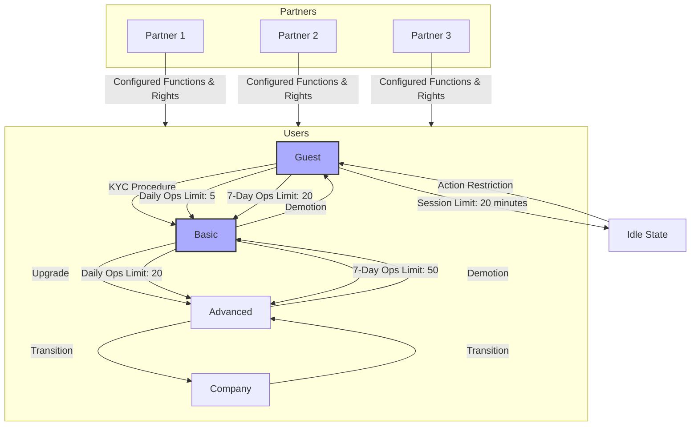

# Users and Roles

Our system provides a range of services for partner users.

The user groups associated with different providers are completely separate within the system.

TPartners may have access to the same features; however, the features and user permissions are configured individually for each partner.

## Types of end users

The table below outlines the basic types of end-user roles:

|User Type|Description|
|---|---|
|guest|Session length: 20 minutes  Max. number of operations per day: 5  Max. number of operations per week: 20.   Transitions to Idle when the maximum number of operations per week is exceeded.|
|basic|KYC-verified client. Session length: unlimited  Max. number of operations per day: 20  Max. number of operations per week: 50.   Transitions to Idle when the maximum number of operations per week is exceeded. |
|company| No limits |
|advanced| No limits |

## Role Model Diagram

**Explanation:**

1. **Partners**:
   - Represented as separate nodes in the `Partners` section.
   - Each partner has a unique set of permissions and functions.

2. **Users**:
   - Represented by different types: `Guest`, `Basic`, `Advanced`, `Company`.
   - Specific limits and states are defined for each user type.

3. **Status Transitions**:
   - Illustrated with arrows showing the conditions for transitions between statuses.

4. **Restrictions**:
   - Special classes for session and operation limits are highlighted to emphasize key rules.